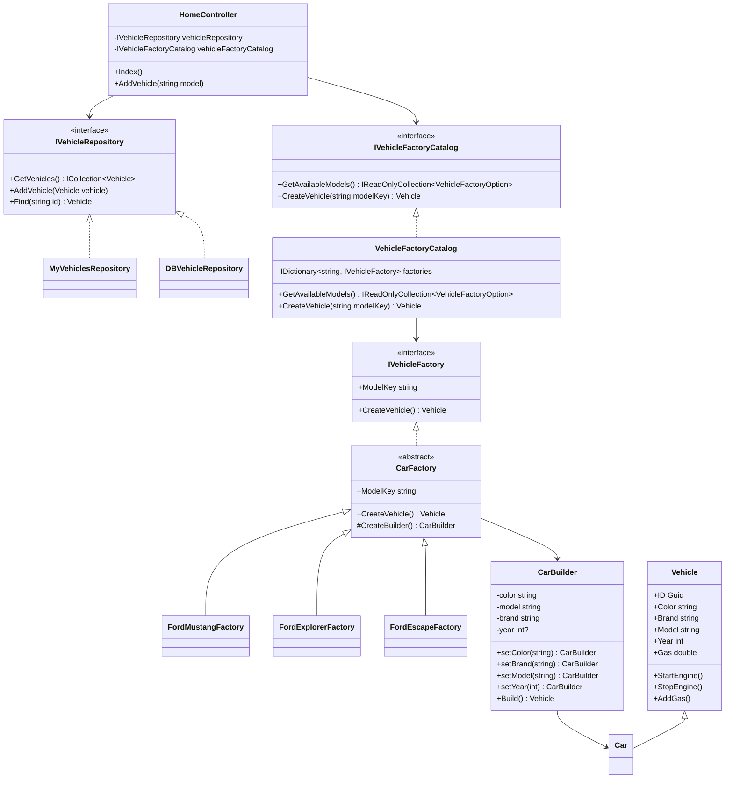

# Propuesta de mejora: patrones y principios SOLID

## 1. Analisis del codigo actual

El proyecto modela vehiculos y permite agregarlos desde la pagina principal. Ya existen piezas valiosas:

- `IVehicleRepository`: abstrae el almacenamiento de vehiculos.
- `MyVehiclesRepository`: permite trabajar en memoria mientras la base de datos no esta lista.
- `CarFactory` y fabricas Ford: encapsulan la creacion de autos.
- `CarBuilder`: concentra la construccion de objetos `Car`.
- `VehicleDefaults`: centraliza propiedades por defecto como el anio actual.

El principal problema detectado era que `HomeController` dependia de fabricas concretas con `new FordMustangFactory()`, `new FordExplorerFactory()` y `new FordEscapeFactory()`. Esto rompe el principio de inversion de dependencias y hace que cada nuevo modelo obligue a modificar el controlador.

## 2. Mejores practicas propuestas

- Aplicar inyeccion de dependencias para repositorios y fabricas.
- Mantener la creacion de vehiculos fuera del controlador.
- Usar nombres de modelo como claves de negocio controladas por un catalogo.
- Centralizar valores por defecto para evitar duplicacion.
- Mantener rutas antiguas para compatibilidad, pero agregar una ruta generica para nuevos modelos.
- Dejar comentarios cortos en los puntos donde se aplica el patron para que el codigo sea entendible.

## 3. Principios SOLID aplicados

### Single Responsibility Principle

`HomeController` queda enfocado en recibir acciones HTTP y coordinar el caso de uso. La creacion de vehiculos queda en las fabricas y la busqueda de la fabrica correcta queda en `VehicleFactoryCatalog`.

### Open/Closed Principle

Para agregar otro modelo no se necesita modificar el controlador. Se crea una nueva fabrica que implemente `IVehicleFactory` y se registra en `ServicesConfiguration`.

### Dependency Inversion Principle

El controlador depende de abstracciones: `IVehicleRepository` e `IVehicleFactoryCatalog`. No depende de clases concretas como `FordExplorerFactory`.

### Liskov Substitution Principle

Todas las fabricas concretas pueden usarse donde se espera `IVehicleFactory`, porque exponen el mismo contrato: `ModelKey` y `CreateVehicle()`.

### Interface Segregation Principle

`IVehicleFactory` contiene solo lo necesario para crear vehiculos. El controlador no recibe metodos internos del builder ni detalles de configuracion.

## 4. Patrones implementados

### Factory Method

`CarFactory` define el flujo comun para crear un vehiculo y delega la configuracion concreta al metodo `CreateBuilder()`. Cada fabrica concreta decide marca, modelo y color.

### Builder

`CarBuilder` permite construir un `Car` paso a paso. Es util porque el vehiculo ya tiene propiedades por defecto y en futuros sprints puede crecer con mas atributos sin llenar los constructores de parametros.

### Repository

`IVehicleRepository` desacopla el controlador del origen de datos. Mientras la base de datos no esta lista, `MyVehiclesRepository` guarda en memoria. Cuando exista la base de datos, se puede registrar `DBVehicleRepository`.

### Singleton

`MemoryCollection` mantiene una coleccion compartida en memoria para simular persistencia durante la ejecucion de la aplicacion.

### Catalog / Registry de fabricas

`VehicleFactoryCatalog` registra las fabricas disponibles y selecciona la correcta por `ModelKey`. Este patron complementa el Factory Method porque evita condicionales y evita que el controlador conozca las clases concretas.

## 5. UML de la propuesta



## 6. Justificacion

La propuesta reduce acoplamiento y prepara el sistema para crecer. Antes, agregar un nuevo modelo implicaba modificar el controlador y la vista. Con el catalogo de fabricas, el controlador solo solicita la creacion de un vehiculo por clave de modelo, y la vista muestra los modelos disponibles desde el mismo catalogo.

Esto mejora mantenibilidad, pruebas y extensibilidad. Tambien conserva el objetivo academico del ejercicio porque se usan patrones reconocibles: Repository para persistencia, Factory Method para creacion, Builder para objetos con muchas propiedades, Singleton para memoria compartida temporal y Registry para resolver fabricas sin condicionales.

## 7. Como agregar un nuevo modelo

1. Crear una clase que herede de `CarFactory`.
2. Definir `ModelKey`.
3. Configurar el `CarBuilder` en `CreateBuilder()`.
4. Registrar la fabrica en `ServicesConfiguration`.

Ejemplo:

```csharp
public class FordBroncoFactory : CarFactory
{
    public override string ModelKey => "Bronco";

    protected override CarBuilder CreateBuilder()
    {
        return new CarBuilder()
            .setColor("Red")
            .setBrand("Ford")
            .setModel("Bronco");
    }
}
```
